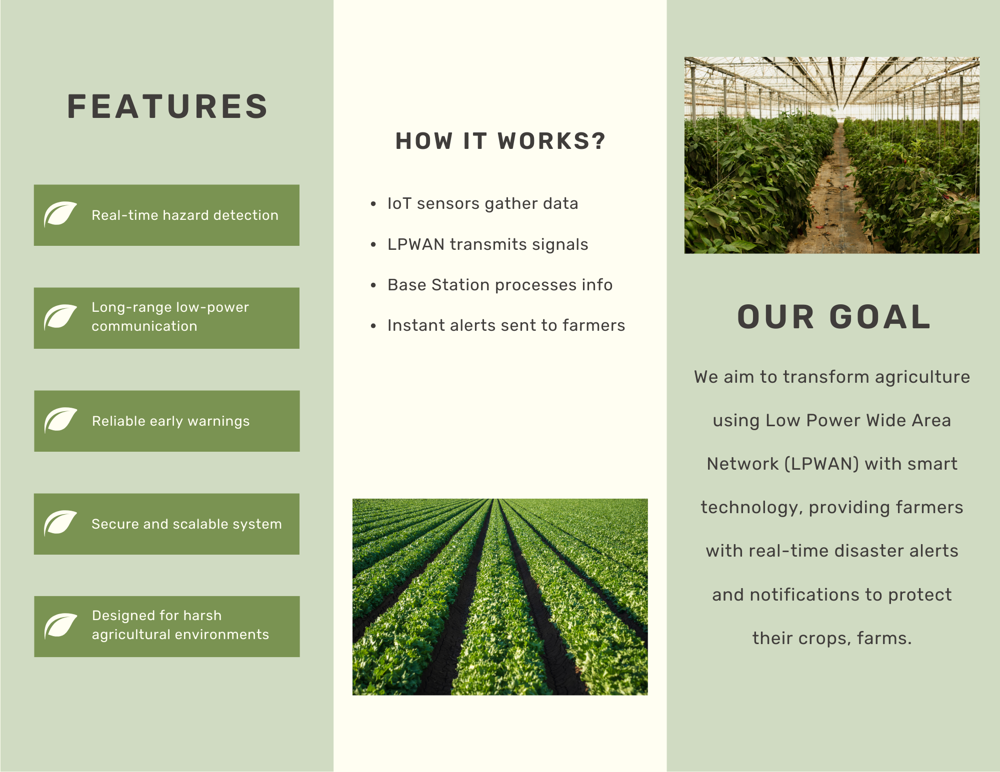

# LPWAN for Smart Agriculture

## Overview
This project is a **Senior Capstone Project (Spring 2025, NJIT)** focused on building a **Low Power Wide Area Network (LPWAN)** for smart agriculture disaster detection.  
The system integrates IoT sensors with a simulated LPWAN backbone in **Cisco Packet Tracer** to provide real-time alerts for hazards such as:

- Wildfires  
- Floods  
- Wildlife intrusions  

The design demonstrates how farmers can leverage energy-efficient, long-range networks to protect crops, livestock, and infrastructure in remote farming environments.

---

## Features
- Wide-area monitoring using LPWAN concepts  
- IoT Sensors: temperature, humidity, soil moisture, motion, fire monitors  
- Automated Fire Safety: fire detection, sprinkler activation, and manual override  
- Near real-time alerts to a central IoT server  
- Basic security controls (encryption, access restrictions)  
- Scalable and modular design for multi-zone farms  

---

## Tech Stack
- Cisco Packet Tracer – Network & IoT simulation  
- IoT Devices – Humidity, soil moisture, fire, and motion sensors  
- Python SBC Script – Automated fire detection and control logic  
- LoRaWAN/LPWAN Concepts – Modeled under Packet Tracer constraints  
- Documentation & Design – Reports, diagrams, presentations  

---

## Repository Structure
```
.
├── Agriculture_LPWAN 04_22_2025 v0.6.pkt # Cisco Packet Tracer simulation
├── Final Report - Cisco Team 7.docx # Detailed project report
├── LICENSE # License file
├── LPWAN_Agriculture_Presentation.pdf # Final presentation slides
├── Network Diagram.png # Topology diagram
├── Poster.png # Project poster
├── Brochure/ # Brochure pages
│ ├── Brochure_page_1.png
│ └── Brochure_page_2.png
└── README.md # This file
```

---

## How to Run the Simulation
1. Install **Cisco Packet Tracer** (version 8.2 or higher recommended).  
2. Open the file:  
3. Explore the following components:
- IoT Gateways, Fire and Humiture monitors, Soil Moisture sensors  
- Automated Sprinkler and Emergency Button logic  
- IoT Server at the farmhouse network  
4. Trigger events (such as fire sensor activation) and observe the automated sprinkler system response.  
5. Review reports and presentation slides in the repository for detailed explanations.  

---

## Visuals

### Project Poster


### Network Diagram


### Brochure
  
  

---

## Team Members
- Pavan Patel – Project Manager & Network/IoT Developer  
- Judrianne Mahigne – IoT Developer  
- Michael Cantarero – Systems Admin  
- Xavier Ruiz – Network Designer  

Instructor: Dr. Eljabiri  
Course: IT491 – Senior Capstone Project  

---

## License
This project is licensed under the MIT License – see the [LICENSE](LICENSE) file for details.  

---

## Acknowledgments
- New Jersey Institute of Technology (NJIT)  
- Cisco Packet Tracer simulation tools  
- Capstone mentorship and guidance from faculty

---

## Achievements
- Awarded **3rd Place** in the Spring 2025 YWCC Capstone Showcase at NJIT.  
- Recognized for outstanding performance, innovation, and practical application of LPWAN in smart agriculture.

